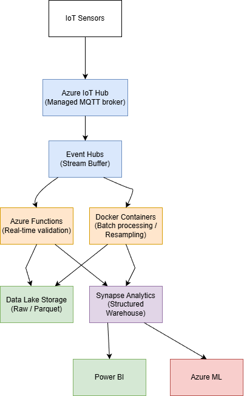

# Part Two: Solution Design

## Overview

For a production-scale version, I researched how to scale up from the local Docker setup I built in Part 1. Based on what I found, I'm proposing Azure services combined with Docker containers. This approach would give us managed infrastructure for the heavy lifting (IoT, streaming, storage) while keeping the flexibility for custom processing logic that we already have working in containers.

## Architecture

### High-Level Flow

```
IoT Sensors → Azure IoT Hub → Event Hubs → Azure Functions (Validation) 
    → Data Lake Storage (Raw) + Synapse Analytics (Structured)
         ↓
    Power BI + Azure ML
```

The flow I'm proposing: sensors send data to IoT Hub, which streams to Event Hubs. Functions would validate and transform the data, then store it in both Data Lake (raw, long-term) and Synapse (structured, for queries). For batch processing like resampling, I'd use Docker containers similar to what we have in Part 1, but deployed to Azure instead of running locally.

### Component Diagram



### Main Components

**Data Ingestion:**
- **Azure IoT Hub**: While researching managed MQTT solutions, I found Azure IoT Hub. It handles MQTT connections from sensors, is fully managed, scales well, and has built-in security. This seems much easier than running our own MQTT broker like we did locally with Mosquitto.

**Streaming:**
- **Event Hubs**: I learned that Event Hubs is Azure's high-throughput streaming service. It would buffer the incoming data stream, and Functions could process messages in real-time for validation and alerts. This replaces the direct MQTT subscription we have in the local collector.

**Storage:**
- **Data Lake Storage Gen2**: For raw data storage, I researched Azure's data lake options. Data Lake Storage Gen2 seems like a good fit - I'd partition by date/sensor similar to how we store raw JSONL files locally. I found that using Parquet format would keep costs down significantly. Lifecycle policies could move old data to Archive tier automatically.

- **Synapse Analytics**: For the data warehouse, I'm proposing Synapse Analytics to replace PostgreSQL. It's designed for BI queries and should handle much larger scale.

**Research point on Synapse:** While researching Synapse, I discovered there are two models: Serverless SQL pools (pay per query) and Dedicated pools (reserved capacity). I'm not sure which is best for our use case. Serverless seems cheaper if queries are sporadic, but dedicated might be better if BI analysts query constantly. I'd want to discuss query patterns with the team and maybe start serverless, then migrate if needed. This is something I'd appreciate input on from someone who's managed this before.

**Processing:**
- **Azure Functions**: For real-time validation and transformation, I'm proposing Azure Functions. It's serverless, scales automatically, and seems simpler than managing our own validation service. This would handle the same validation logic we have in the collector, but as serverless functions.

- **Docker Containers** (Container Instances/Container Apps): For batch jobs like resampling to 1-minute aggregates or complex data quality checks, I'd use Docker containers. In Part 1, I already have a Docker container for the collector. For production, I researched how to run Docker containers in Azure and found Container Instances and Container Apps as options. The advantage is we can test the exact same container locally with docker-compose, then deploy to Azure with minimal changes.

**Research point on containers:** While researching Azure container options, I found two main choices: Container Instances (simpler, pay-per-use) and Container Apps (more features, auto-scaling). Container Instances seems fine for scheduled batch jobs, but if we need more orchestration later, Container Apps might be better. I'm not sure if it's worth the extra complexity upfront. I'd like to hear what's worked well in similar projects.

**Analytics:**
- **Power BI**: I learned that Power BI connects directly to Synapse, which would let BI analysts build dashboards without needing to understand the underlying infrastructure.

- **Azure ML**: For data scientists, I found that Azure ML provides notebooks and model training. Models can be deployed as Docker containers too, which fits with what we're already doing.

## Technologies

I'm proposing Azure because:
- It integrates well with Microsoft tools (Power BI, Teams) that many enterprises already use
- Managed services would reduce operational overhead compared to self-hosting
- Good support for containers (which I know from Part 1 and Docker experience)
- From what I researched, it seems cost-effective at scale

**Key services I'm proposing:**
- IoT Hub → Event Hubs → Data Lake → Synapse
- Data Factory for ETL orchestration
- Azure Monitor for observability
- Container Instances/Container Apps for Docker workloads

**Why Docker?**
In Part 1, I used Docker for the collector service, and it worked really well. For custom processing jobs in production, Docker gives us:
- Local development and testing (we can use docker-compose like we do now)
- Consistent environments (dev/staging/prod)
- Easy deployment to Azure Container Instances
- Can package Python scripts, Spark jobs, or whatever we need

The fact that we can develop and test locally, then deploy the same container to Azure, is a big advantage.

## Deployment

I'd use Infrastructure as Code to define everything. This makes it reproducible and version-controlled, which I learned is a best practice.

**ARM vs Bicep vs Terraform:** I've used ARM templates before in coursework, but while researching, I found that Bicep looks cleaner and is Azure-native. Terraform is more cloud-agnostic but adds another tool. Since we'd be all-in on Azure, Bicep might be the sweet spot - but I'd want to check what the team already uses. No point introducing new tooling if there's already a standard.

**CI/CD:**
Based on what I researched, I'm proposing:
1. Push code → Build Docker images → Push to Azure Container Registry
2. Deploy infrastructure via ARM/Bicep
3. Deploy containers to Container Instances or Container Apps

The nice thing about containers is we can test the exact same image locally with docker-compose (like we do now), then deploy to Azure with minimal changes. This is one of the reasons I'm proposing to stick with Docker.

## Monitoring

**Azure Monitor** for metrics and alerts:
- Message throughput, error rates
- Data pipeline lag
- Query performance in Synapse
- Container health

**Application Insights** for distributed tracing - I learned this helps debug when something goes wrong across multiple services, which would be useful as the system gets more complex.

I'm proposing to set up alerts for:
- Error rate > 1%
- Pipeline lag > 5 minutes
- Query performance degradation

These thresholds are based on what I found in documentation, but I'd want to adjust them based on actual production experience.

## Data Quality

**Real-time checks** (in Functions):
- Schema validation (similar to what we do with Pydantic in Part 1)
- Range checks (min/max per sensor)
- Duplicate detection

**Batch checks** (Docker containers, scheduled via Data Factory):
- Completeness: expected vs actual message counts
- Statistical outliers
- Cross-sensor consistency

Invalid data would get flagged but not deleted - we'd store it in a "quarantine" area for investigation. Better to have too much data than lose something important. This is the same approach we use in Part 1.

**Research question on data quality approach:** While thinking about this, I'm wondering whether to do quality checks in Functions (real-time) vs batch jobs (Docker containers). Real-time catches issues faster, but batch might be more thorough. Maybe both? I'd want to discuss with the team what quality issues they've seen before and how critical real-time detection is vs. comprehensive analysis.

## Customer Communication

**For BI Analysts:**
- Direct Synapse connection in Power BI
- Pre-aggregated views (hourly/daily summaries) - similar to the views we created in PostgreSQL
- Example queries and documentation (like the example_queries.sql we have)
- Weekly office hours for questions

**For Data Scientists:**
- Access to Data Lake via Azure ML notebooks
- Feature store for ML-ready datasets
- Model deployment as Docker containers

**Communication:**
- Teams channel for alerts and updates
- Weekly email digest with data quality metrics
- Documentation in Azure Purview (data catalog) for self-service discovery

## Cost Considerations

For ~1M messages/day, I did some rough cost estimation based on Azure pricing:
- IoT Hub: ~$50/month
- Event Hubs: ~$25/month
- Data Lake Storage: ~$20/month (with lifecycle policies)
- Synapse (serverless): ~$150/month (depends on queries)
- Functions/Containers: ~$50/month
- **Total: ~$300-400/month**

Costs scale with usage, but the serverless options (Functions, Synapse serverless) help keep costs down when not actively querying.

**Research question on cost optimization:** While researching pricing, I learned about reserved capacity options. I'm not sure if we should use reserved capacity for anything upfront. It's cheaper long-term, but we don't know the actual usage patterns yet. Maybe start pay-as-you-go, monitor for a few months, then commit to reserved if it makes sense? I'd appreciate guidance on when to make that decision.

## Security

Based on security best practices I researched:
- TLS for all connections
- Azure AD for authentication
- RBAC for fine-grained permissions
- Data Lake and Synapse support column-level security
- Private endpoints to keep data off public internet

**Research question on security:** I know we need private endpoints for production, but I'm not 100% sure about the network architecture. Should everything be in a VNet? What about the balance between security and ease of access for developers? I'd definitely want to review this with the security team before implementing. This is an area where I'd need more guidance.

## What I'd Do Differently from Local Setup

The local setup uses PostgreSQL, which is fine for development and learning. For production, based on my research, I'm proposing:
- Use Synapse for better BI performance and scale (PostgreSQL works but isn't optimized for analytics)
- Data Lake for long-term raw storage (cheaper than keeping everything in a database)
- Managed services instead of self-hosted (less ops overhead - no need to manage PostgreSQL ourselves)
- Containers for batch processing (more flexible than database-only approach, and we already have this working)

The core principles stay the same: collect, validate, store raw + structured, make it queryable. Just with more scale and less operational burden. The architecture I'm proposing is essentially scaling up what we built locally.

## Decisions I'd Want to Discuss

**1. Event Hubs vs Service Bus:** While researching streaming options, I found both Event Hubs and Service Bus. I'm leaning toward Event Hubs for high throughput, but I learned that Service Bus has better message ordering and transactions. If we need exactly-once processing or strict ordering, Service Bus might be better. I'm not sure what the requirements are here - would need to clarify with the team.

**2. Data Factory vs Logic Apps for orchestration:** I found that Data Factory is more data-focused, while Logic Apps is more workflow-focused. For ETL pipelines, Data Factory seems right, but if we need complex business logic or integrations, Logic Apps might fit better. Maybe both? I'd want to see what patterns the team already uses.

**3. Monitoring depth:** I've outlined basic monitoring, but I'm not sure if we need more advanced stuff like distributed tracing everywhere, or if Application Insights is enough. Depends on how complex debugging gets in production. Would be good to learn from past incidents the team has dealt with.

**4. Disaster recovery:** I mentioned multi-region as future work, but maybe we should plan for it from the start? Depends on business requirements - how critical is uptime? What's the RTO/RPO? I'd need to understand the business impact before making that call. This is something I'd want to discuss with the team.

## Future Enhancements

Based on my research, potential future additions could include:
- Real-time dashboards using Stream Analytics
- ML models for predictive maintenance
- Edge computing (Azure IoT Edge) for processing at sensor locations
- Multi-region for disaster recovery

But I'd start simple and add these as needed. No point over-engineering from day one. The local setup taught me that it's better to get something working first, then iterate.

## Final Thoughts

This is my initial design based on what I've researched and learned from building Part 1, but I'm sure there are things I'm missing or overthinking. I'd want to review this with the team, especially:
- Anyone who's built similar pipelines before
- The BI team to understand their query patterns
- Security/compliance to make sure we're meeting requirements
- Cost management to validate my estimates

I'm confident in the overall approach (Azure + Docker, building on what we learned in Part 1), but the details around sizing, optimization, and some architectural choices would benefit from more experienced input. I'm eager to learn from the team's experience and refine this design together.
